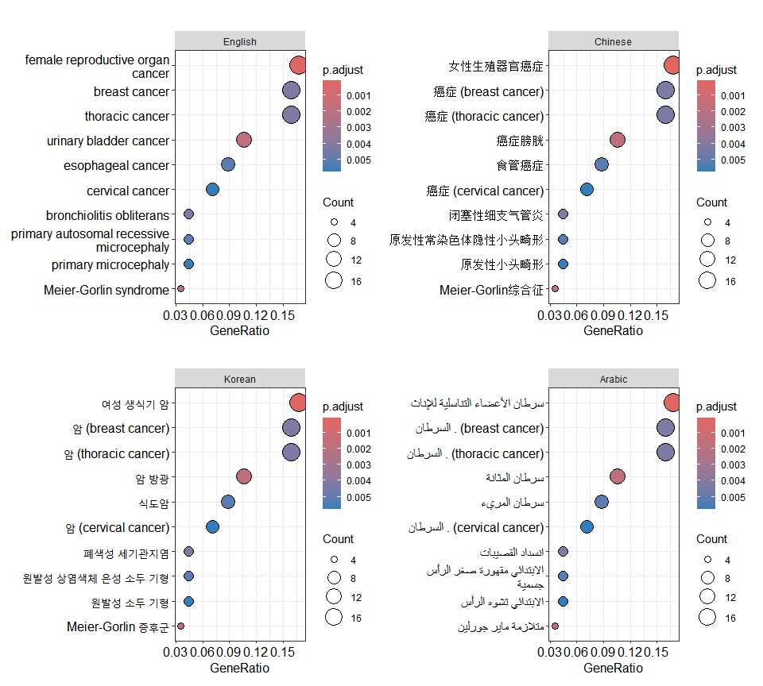

<!-- README.md is generated from README.Rmd. Please edit that file -->

# `fanyi`: Translate Words or Sentences via Online Translators


[](https://cran.r-project.org/package=fanyi)


Useful functions to translate text for multiple languages using online
translators. For example, by translating error messages and descriptive
analysis results into a language familiar to the user, it enables a
better understanding of the information, thereby reducing the barriers
caused by language.

## :writing_hand: Authors

Guangchuang YU

School of Basic Medical Sciences, Southern Medical University

<https://yulab-smu.top>

## :arrow_double_down: Installation

Get the released version from CRAN:

``` r
install.packages("fanyi")
```

Or the development version from github:

``` r
## install.packages("yulab.utils")
yulab.utils::install_zip_gh("YuLab-SMU/fanyi")
```

## :beginner: Usages

### to switch from different online translators:

use `set_translate_source()` to set the default translator using in
`translate()`

### to use `baidu` translate:

1.  go to <https://fanyi-api.baidu.com/manage/developer> and regist as
    an individual developer
2.  get `appid` and `key` (密钥)
3.  set `appid` and `key` with `source = "baidu"` using
    `set_translate_option()`
4.  have fun with `translate()`

### to use `bing` translate:

1.  regist a free azure account
2.  enable `Azure AI services | Translator` from
    <https://portal.azure.com/>
3.  create a translation service with free tier pricing version (you
    need a visa/master card to complete registion and will not be
    charged until exceed 2 million characters monthly)
4.  get your `key` and `region`
5.  set `key` and `region` with `source = "bing"` using
    `set_translate_option()`
6.  have fun with `translate()`

## :ideograph_advantage: Examples

``` r
library(fanyi)

##
## run `set_translate_option()` to setup
##

text <- 'clusterProfiler supports exploring functional characteristics 
    of both coding and non-coding genomics data for thousands of species 
    with up-to-date gene annotation'

translate(text, from='en', to='zh')
```

    ## [1] "clusterProfiler支持通过最新的基因注释探索数千个物种的编码和非编码基因组学数据的功能特征"

``` r
translate(text, from='en', to='jp')
```

    ## [1] "clusterProfilerは、最新の遺伝子注釈による数千種の種の符号化および非符号化ゲノム学データの機能的特徴の探索を支援する"

``` r
library(DOSE)
library(enrichplot)
data(geneList)
de <- names(geneList)[1:200]
x <- enrichDO(de)
p <- dotplot(x)
p2 <- translate_ggplot(p, axis='y')
aplot::plot_list(p, p2)
```

<!-- -->

``` r
symbol <- c("CCR7", "CD3E")
gene <- clusterProfiler::bitr(symbol, 
            fromType = 'SYMBOL', 
            toType = 'ENTREZID', 
            OrgDb = 'org.Hs.eg.db')
```

    ## 

    ## 'select()' returned 1:1 mapping between keys and columns

``` r
gene
```

    ##   SYMBOL ENTREZID
    ## 1   CCR7     1236
    ## 2   CD3E      916

``` r
res <- gene_summary(gene$ENTREZID)
names(res)
```

    ## [1] "uid"         "name"        "description" "summary"

``` r
translate(res$description)
```

    ## [1] "C-C基序趋化因子受体7"      "T细胞受体复合体的CD3ε亚基"

``` r
translate(res$summary[1])
```

    ## [1] "该基因编码的蛋白质是G蛋白偶联受体家族的成员。该受体被鉴定为EB病毒（EBV）诱导的基因，被认为是EB病毒对B淋巴细胞影响的媒介。这种受体在各种淋巴组织中表达，并激活B和T淋巴细胞。它已被证明可以控制记忆T细胞向炎症组织的迁移，并刺激树突细胞成熟。据报道，趋化因子（C-C基序）配体19（CCL19/ECL）是该受体的特异性配体。该受体介导的信号调节淋巴结中的T细胞稳态，也可能在T细胞的激活和极化以及慢性炎症发病机制中发挥作用。该基因的选择性剪接导致多种转录物变体。【RefSeq提供，2014年9月】"
